# OCPP 1.6J Gateway – Architecture & Workflow

## Sequence Diagram

```mermaid
sequenceDiagram
    participant Charger as EV Charger
    participant MS as OCPP Microservice
    participant C8Y as Cumulocity IoT

    Charger->>MS: HTTP GET /ws/{chargeBoxId} (Upgrade: websocket)
    MS-->>Charger: 101 Switching Protocols
    Note over Charger,MS: WebSocket established

    Charger->>MS: [2, "id", "MeterValues", {...}]
    MS-->>Charger: [3, "id", {}]
    MS->>C8Y: POST /measurement/measurements (REST)

    loop Every 5s
        MS->>C8Y: GET /devicecontrol/operations?status=PENDING (REST)
        C8Y-->>MS: PENDING c8y_StopCharging operations
    end
    MS->>Charger: [2, "uuid", "RemoteStopTransaction", {"transactionId": N}]
    Charger-->>MS: [3, "uuid", {"status": "Accepted"}]
    MS->>C8Y: PUT /devicecontrol/operations/{id} status=SUCCESSFUL (REST)
```

## Component Overview

| Class | Role |
|-------|------|
| `WebSocketConfig` | Registers the WebSocket handler at `/ws/{chargeBoxId}` |
| `OcppWebSocketHandler` | Parses OCPP JSON arrays, dispatches by action, sends CallResult |
| `ChargePointSessionRegistry` | Thread-safe `ConcurrentHashMap` of chargeBoxId → WebSocketSession |
| `MeasurementService` | Translates MeterValues → Cumulocity `c8y_EnergyMeasurement` (REST) |
| `OperationService` | Polls PENDING `c8y_StopCharging` ops, sends `RemoteStopTransaction` via WebSocket |

## Key Design Points

- **No dedicated REST controller** — the WebSocket upgrade IS the HTTP entry point (`GET /ws/{chargeBoxId}` with `Upgrade: websocket` header).
- **chargeBoxId** is the Cumulocity device GId (managed object ID). It is embedded in the WebSocket URL path so the microservice knows which device is connected.
- **Internal → Cumulocity**: Always REST via the SDK (`MeasurementApi`, `DeviceControlApi`). No MQTT.
- **OCPP message format**: `[messageTypeId, uniqueId, action, payload]` — all JSON arrays over the WebSocket text channel.
